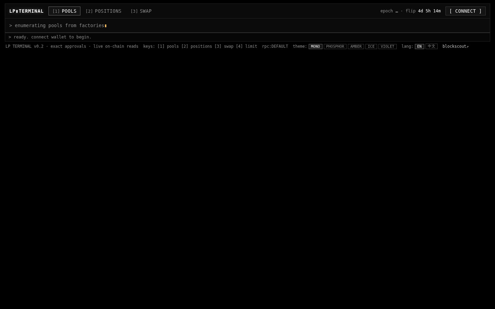
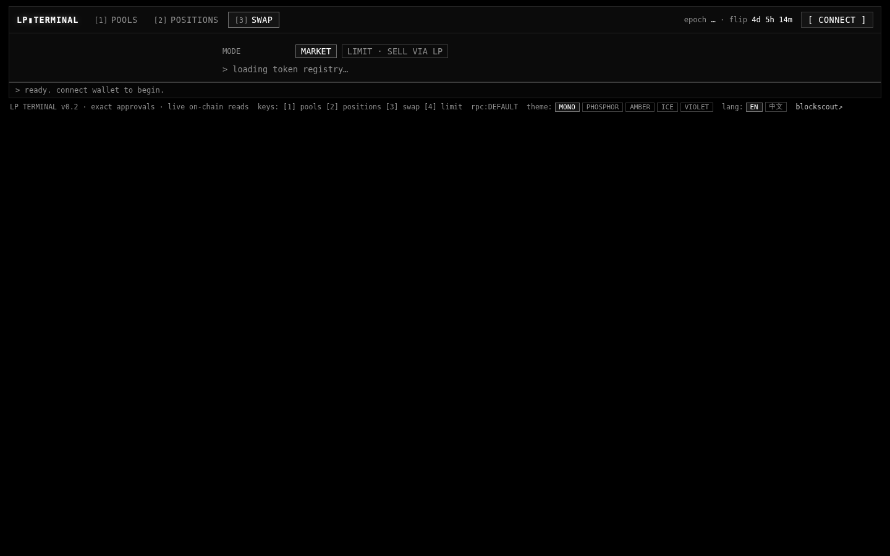
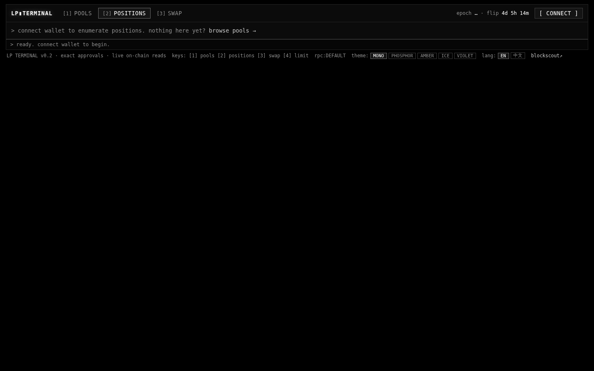

<p align="center">
  
</p>

<h1 align="center">🚀 MasbroV1 — LP Terminal</h1>

<p align="center">
  <strong>Terminal-style DeFi interface for Robinhood Chain (chainId 4663)</strong>
  <br />
  UP33 (ve(3,3) DEX) + Uniswap v2 & v3 — all in one place
</p>

<p align="center">
  
  
  
  
  
</p>

---

## 📸 Screenshots

| Pools Tab | Swap Tab | Positions Tab |
|:---:|:---:|:---:|
|  |  |  |

---

## ✨ Features

### 🔄 Swap
- **Market Swap** — KyberSwap aggregator quotes vs UP33-native best route, side-by-side comparison with bps difference
- **Limit Orders** — Sell via one-sided CL range order (maker economics: 0% fees + earn while filling)
- **ETH ⇄ WETH** wrap/unwrap built in

### 💧 Pools
- **Multi-Protocol** — UP33 (ve3,3) + Uniswap v2 & v3 in one unified table
- **Rich Data** — TVL, 24h Volume, 24h Fees, Fee APR, Emit APR, weekly emissions, vote share
- **Smart Search** — Search by token address, pool address, symbol, or pair — with dust filter
- **Add Liquidity** — v2 auto-ratio, CL range picker with presets, one-sided ranges, zap one-token deposits
- **⚡ ZAP** — Fund any position with a single token; auto-swaps to match deposit ratio

### 📊 Positions
- **Multi-Protocol Dashboard** — UP33 CL/v2 + Uniswap v3 positions
- **Live Metrics** — LP value in USD, pending UP rewards, earning rate (UP/day + $/day)
- **Full Management** — Stake/Unstake, Claim UP, Collect fees, Increase/Decrease, Withdraw
- **Range Bar** — Visual price range with in/near/out-of-range indicators
- **Protocol Badges** — UP arrow / Uniswap unicorn, brand-colored

### 🛡️ Safety
- **4 Gates on Kyber Calldata** — router whitelist, value match, amount match, slippage protection
- **Exact-amount Approvals** — no infinite approvals
- **Chain-Pinned** — all writes verify chainId 4663
- **Bring Your Own RPC** — footer RPC control with live validation
- **CSP Ready** — no inline scripts, no eval, self-hosted assets

### 🌐 i18n
- English & Chinese (react-i18next, typed keys)
- Language switcher persisted in localStorage
- Wallet modal follows language setting

---

## 🛠️ Tech Stack

| Technology | Purpose |
|:-----------|:--------|
| **React 18** | UI Framework |
| **Vite 6** | Build Tool |
| **TypeScript** | Language |
| **viem / wagmi** | Blockchain Interaction |
| **RainbowKit** | Wallet Connection |
| **react-i18next** | Internationalization |
| **KyberSwap API** | Aggregator Swaps |
| **DexScreener / Goldsky** | Pool Data & Stats |
| **SQLite (indexer)** | Pool Catalog Backend |

---

## 🚀 Deployment — Vercel

Deploy to Vercel in 3 clicks:

### One-Click Deploy

[](https://vercel.com/new/clone?repository-url=https%3A%2F%2Fgithub.com%2Fcodewithmasbrodev%2FMasbroV1)

### Manual Deploy

**Prerequisites:**
- A [Vercel](https://vercel.com) account
- The repo cloned or forked

**Steps:**

```bash
# 1. Clone the repo
git clone https://github.com/codewithmasbrodev/MasbroV1.git
cd MasbroV1

# 2. Install dependencies
npm install

# 3. Set environment variables on Vercel Dashboard (optional — all have defaults)
#    Go to Project → Settings → Environment Variables
#
#    RPC                          # Private RPC URL (keep secret — NOT for public builds)
#    KYBERSWAP_AGGREGATOR_API_BASE_URL  # Kyber aggregator base URL
#    KYBERSWAP_CHAIN              # Chain slug (default: robinhood)
#    VITE_WALLETCONNECT_PROJECT_ID      # WalletConnect project ID
```

**Important Security Note:**  
The `RPC` environment variable is baked into the JS bundle at build time.  
**Never** set `RPC` for public deployments. Public builds use the Robinhood Chain public RPC instead.

### Deploy via Git (Recommended)

1. Push your repo to GitHub
2. Go to [vercel.com](https://vercel.com) → **Add New Project**
3. Import the `codewithmasbrodev/MasbroV1` repo
4. Vercel auto-detects Vite — no config changes needed
5. Click **Deploy** 🚀

### Deploy via CLI

```bash
# Install Vercel CLI
npm i -g vercel

# Deploy
vercel --prod
```

### After Deploy

Your app will be live at `https://masbro-v1.vercel.app` (or your custom domain).

**Environment variables** can be configured later in:
Vercel Dashboard → Project → Settings → Environment Variables

Then redeploy from the Deployments tab.

---

## 💻 Local Development

```bash
# Install
npm install
cp .env.example .env

# Optional: validate chain reads
npm run smoke

# Optional: start pool indexer (for uniswap pool discovery)
npm run indexer

# Start dev server
npm run dev         # → http://localhost:5173
```

### Environment Variables

See `.env.example` for the full annotated template.

| Key | Required | Description |
|:----|:---------|:------------|
| `RPC` | ❌ Optional | Private RPC URL (personal builds only) |
| `KYBERSWAP_AGGREGATOR_API_BASE_URL` | ❌ | Kyber aggregator |
| `KYBERSWAP_CHAIN` | ❌ | Chain slug (`robinhood`) |
| `KYBERSWAP_ROUTER_ADDRESS` | ❌ | Router whitelist |
| `KYBERSWAP_FEE_BPS` | ❌ | Platform fee in bps |
| `KYBERSWAP_FEE_RECEIVER` | ❌ | Fee receiver address |
| `VITE_WALLETCONNECT_PROJECT_ID` | ❌ | WalletConnect project ID |

---

## 🔧 Pool Indexer

The project includes a self-hosted pool indexer for Uniswap discovery:

```
npm run indexer    # → http://localhost:8787
```

Built with zero npm dependencies beyond the app's own (`viem`, `tsx`). Uses Node.js built-in SQLite (≥22.13).

**API Endpoints:**
- `GET /api/pools` — Pool catalog with search, filter, sort, pagination
- `GET /api/tokens` — Token autocomplete
- `GET /api/health` — Indexer health

---

## 🧪 Scripts

| Script | Description |
|:-------|:------------|
| `npm run dev` | Start Vite dev server (:5173) |
| `npm run build` | TypeScript check + production build |
| `npm run preview` | Preview production build |
| `npm run smoke` | Validate chain reads |
| `npm run indexer` | Start pool indexer (:8787) |
| `npm run typecheck` | TypeScript check only |

---

## ⚠️ Disclaimer

This software is provided as-is under the MIT license, with **no warranty of any kind**. It is an unaudited interface to third-party smart contracts that this project does not control. Interacting with DeFi protocols can result in total loss of funds. You are solely responsible for reviewing the code, verifying every contract address, and for any transaction your wallet signs.

---

## 📄 License

MIT © Masbro Bitcoin

---

<p align="center">
  <sub>Built with ❤️ for the Robinhood Chain DeFi ecosystem</sub>
</p>
